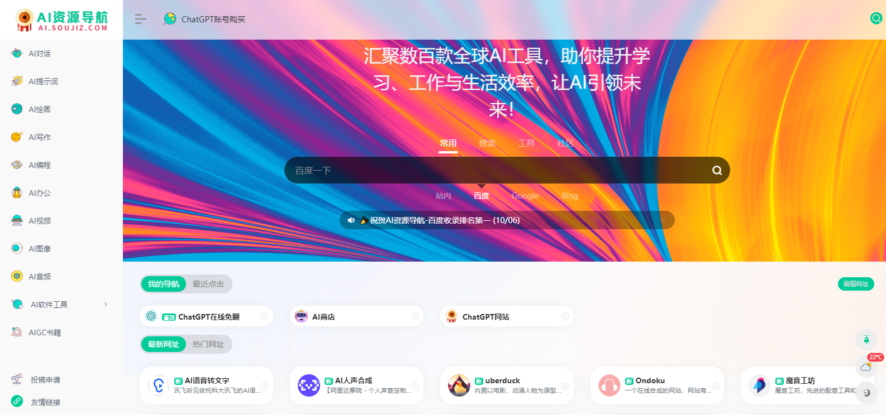
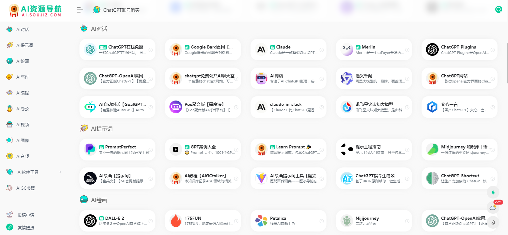
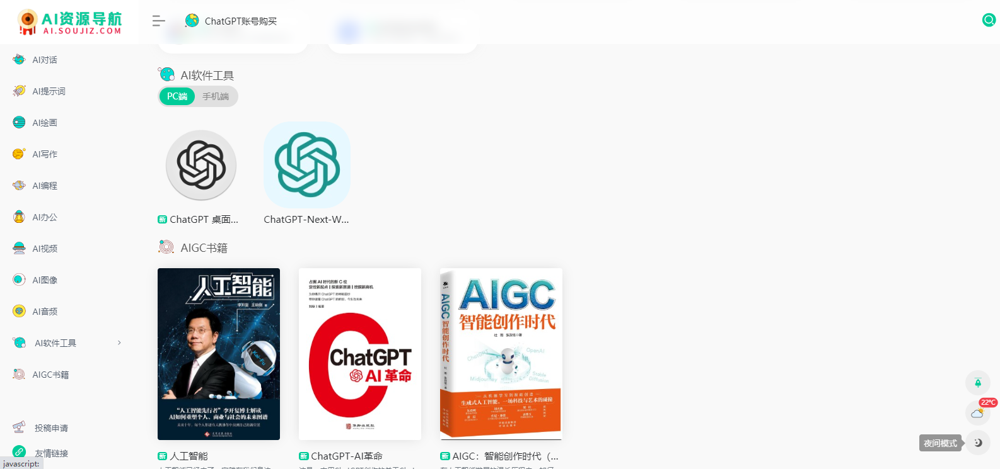

一款AI资源导航，汇聚了数百款全球AI工具，助你提升学习、工作与生活效率，让AI引领你的未来！这是一个专注于ai 导航类资源网，网站收集了很多关于人工智能（AI）的网址/app/公众号/AI相关书籍。

目前的内容包括但不限于AI ChatGPT对话，AI提示词，Midjourney绘画, AI图像，AI写作，AI视频，AI编程，AI办公，AI软件工具，AI开放平台、AI资讯、ai有趣网站、AI开源项目、AI技术、AI商业化等。

## 网站域名
域名：[AI资源导航](ai.soujiz.com)；全称：ai资源导航；解释即为：AI（人工智能）+ soujiz.com(搜集站缩写)组合。

## 百度排名
网站正式上线三天，已被百度收录，在百度搜索AI资源导航关键词中排名第一，点我百度一下即可查询。

## AI资源导航优势
### 综合性：
AI资源导航提供了广泛而全面的人工智能相关资源，涵盖了各个领域和应用方向。用户可以在一个平台上找到多种类型的AI资源，如教程、论文、开源项目等。
### 精选内容：
AI资源导航通过筛选和评估，为用户提供高质量和有价值的内容。这样一来，用户无需花费大量时间去搜索和验证信息来源，可以直接从可靠且经过审核的资源中获取所需知识。
### 更新及时：
由于人工智能领域发展迅速且变化频繁，很多新技术、新算法以及最新研究成果都会被不断发布。AI资源局导航通常会定期更新其收录内容，并确保用户获得最新资讯与进展。
### 分类整理：
AI资源导航将各类人工智能相关资料进行分类整理，在不同主题或领域下建立清晰结构，并提供易于浏览与检索的界面。这使得用户可以更快地找到自己感兴趣或需要深入了解的特定主题。
综上所述，AI资源导航通过整合、精选、更新及时等优势帮助用户快速获取可靠且有用的人工智能相关信息并促进交流与学习。

## 效果图展示

## 最后
ai.soujiz.com（AI资源导航网）以“人工智能应用与资讯传播平台，让人工智能应用项目落地，传播最新资讯，让人工智能、机器学习等技术在未来不再神秘、

让AI技术飞入寻常百姓家”这个口号，这个想法为中心，扩宽道路，同时降低普罗大众对人工智能认识和应用的门槛。致力于为人工智能兴趣爱好者及从业者提供优秀、可持续发展的人工智能导航网。

后续也会不断更新，修改完善更多的内容，欢迎收藏，持续关注…..
